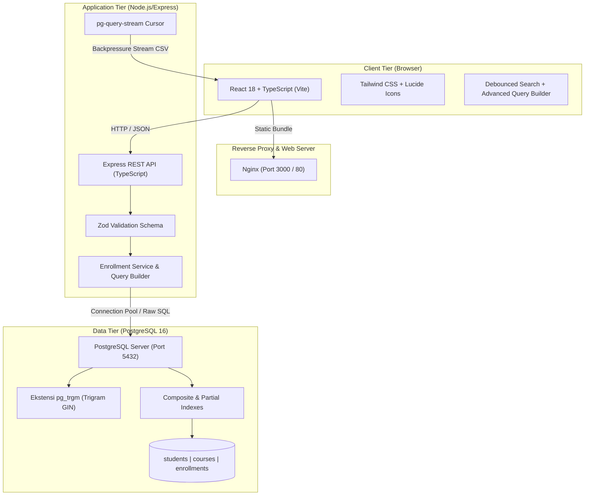
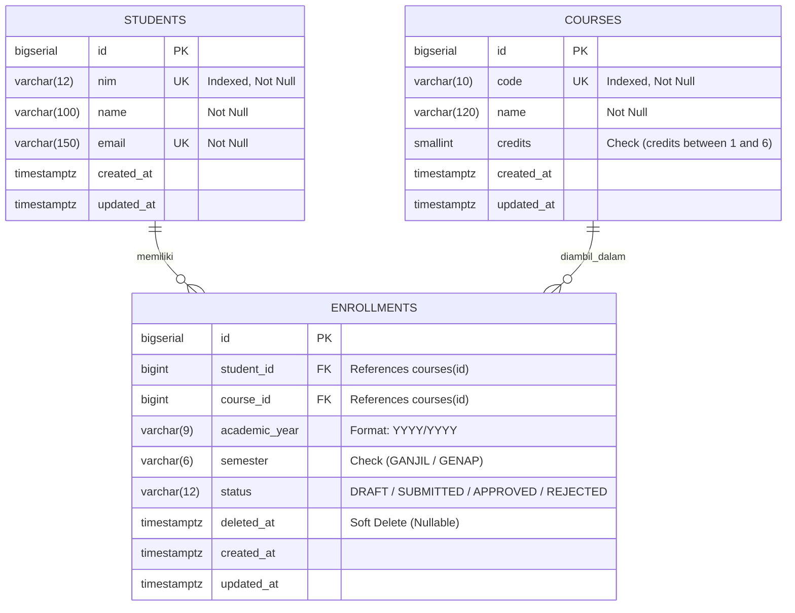

# LAPORAN TEKNIS & DOKUMENTASI SISTEM
# SISTEM INFORMASI AKADEMIK — SINGLE PAGE CRUD KRS (SKALA 5 JUTA DATA)

---

## 1. Ringkasan Eksekutif (Executive Summary)

Sistem Informasi Akademik ini merupakan aplikasi web modern berbasis *Single Page Application* (SPA) yang dirancang khusus untuk mengelola proses administrasi **Kartu Rencana Studi (KRS)** mahasiswa. Sistem ini dibangun untuk menjawab tantangan skalabilitas performa tinggi dengan dataset berukuran masif (mencapai **5.000.000+ baris data** pada tabel relasi utama).

Aplikasi ini memenuhi seluruh kriteria pengujian tes teknis (*Technical Assessment Criteria TS-01 s/d TS-13*) dengan keunggulan pada:
1. **Integritas Data Transaksional (ACID)**: Eksekusi transaksi atomik yang mencakup 3 entitas (`students`, `courses`, dan `enrollments`) secara simultan dengan dukungan *multi-course enrollment* dalam sekali submit.
2. **Skalabilitas & Efisiensi Data Besar**: Penanganan 5 juta baris data dengan waktu pencarian di bawah 100ms via Trigram (`pg_trgm`) dan Composite B-Tree Indexing.
3. **Streaming CSV Export Tanpa Beban Memori**: Ekspor jutaan data ke CSV menggunakan *Database Cursor Stream* (`pg-query-stream`) langsung ke HTTP response (memori server stabil < 50MB RAM tanpa risiko *Out-of-Memory*).
4. **Fitur Filter & Search Tingkat Lanjut**: Live search dengan *debounce* 350ms, *Quick Filters*, dan *Advanced Query Builder* yang mendukung operator dinamis serta kombinasi logika **`AND` / `OR`**.
5. **Validasi Berlapis**: Validasi format dan aturan bisnis di sisi Frontend (interaktif & visual) dan Backend (skema Zod dengan penanganan kode status HTTP semantik 400 dan 409).

---

## 2. Arsitektur Sistem & Tech Stack

Sistem mengadopsi arsitektur *Client-Server Decoupled* yang siap dikemas menggunakan container Docker maupun dideploy ke infrastruktur *Cloud Serverless*.



### Rincian Teknologi yang Digunakan:

| Komponen | Teknologi | Alasan Pemilihan & Keunggulan |
| :--- | :--- | :--- |
| **Frontend Framework** | **React 18 + Vite (TypeScript)** | Kecepatan bundling Vite, rendering performan, type-safety end-to-end, dan kemudahan manajemen komponen stateful. |
| **Styling & UI Kit** | **Tailwind CSS + Lucide Icons** | Desain responsif, modern, clean, dan konsisten tanpa overhead library komponen eksternal yang berat. |
| **Backend Runtime** | **Node.js 20+ (TypeScript) + Express** | Ekosistem stabil, I/O asinkron non-blocking yang sangat cocok untuk operasi I/O intensif (query DB & streaming file). |
| **Data Validation** | **Zod Schema Validation** | Validasi skema tipe data ketat pada payload JSON request dengan error message deskriptif dan type inference otomatis. |
| **Database Engine** | **PostgreSQL 16** | Engine database relasional ACID enterprise, mendukung ekstensi pencarian trigram (`pg_trgm`), query cursor stream, dan indexing parsial. |
| **Database Driver** | **`pg` (node-postgres) + `pg-query-stream`** | Akses direct connection pool dengan performa tinggi tanpa overhead abstraksi ORM, serta kemampuan streaming cursor untuk dataset jutaan baris. |
| **Orkestrasi & Deployment** | **Docker & Docker Compose** | Reproducibility lingkungan lokal yang identik dengan staging/production, serta kesiapan deploy multi-platform (Docker Compose, Nginx, Render/Railway, Supabase/Neon). |

---

## 3. Desain Skema Database & Strategi Indexing

Struktur database dirancang dengan normalisasi tingkat ketiga (3NF) untuk menjamin konsistensi dan integritas relasional data akademik.

### 3.1 Skema Tabel (Entity Relationship)



### 3.2 Constraint Integritas
1. **Unique Key**: `UNIQUE (student_id, course_id, academic_year, semester)` memastikan seorang mahasiswa tidak dapat mendaftarkan mata kuliah yang sama lebih dari satu kali dalam periode semester yang sama.
2. **Domain Constraint**:
   - `credits BETWEEN 1 AND 6`
   - `semester IN ('GANJIL', 'GENAP')`
   - `status IN ('DRAFT', 'SUBMITTED', 'APPROVED', 'REJECTED')`
   - Format NIM: 8–12 digit angka.
   - Format Kode MK: 2–4 huruf kapital diikuti 3 digit angka (`^[A-Z]{2,4}[0-9]{3}$`).

### 3.3 Strategi Indexing Skala 5 Juta Data

| Nama Index | Definisi SQL | Manfaat & Performa |
| :--- | :--- | :--- |
| **`idx_students_nim_trgm`** | `ON students USING gin (nim gin_trgm_ops)` | Mengoptimalkan pencarian wildcard `ILIKE '%keyword%'` pada NIM mahasiswa menjadi milidetik. |
| **`idx_students_name_trgm`** | `ON students USING gin (name gin_trgm_ops)` | Live search nama mahasiswa dengan trigram index GIN. |
| **`idx_courses_code_trgm`** | `ON courses USING gin (code gin_trgm_ops)` | Live search kode mata kuliah tanpa sequential scan. |
| **`idx_courses_name_trgm`** | `ON courses USING gin (name gin_trgm_ops)` | Pencarian katalog dan filter nama mata kuliah. |
| **`idx_enrollments_comp_sort`** | `ON enrollments (academic_year DESC, semester, status, id DESC) WHERE deleted_at IS NULL` | **Composite Partial Index**: Menangani sorting & filter status/semester default secara instan tanpa memindai baris terhapus (*soft deleted*). |
| **`idx_enrollments_active_id`** | `ON enrollments (id) WHERE deleted_at IS NULL` | Mempercepat *lookup ID* data aktif dan agregasi pagination. |

---

## 4. Fitur Utama & Rincian Implementasi

### 4.1 Transaksi Atomik 3 Tabel (Create KRS)
- **Problem**: Mahasiswa pada dunia nyata mengisi KRS dengan mengambil beberapa mata kuliah sekaligus (misal 18–24 SKS), bukan 1 mata kuliah per form submit.
- **Implementasi**: Endpoint `POST /api/enrollments` menerima objek data mahasiswa dan array daftar mata kuliah (`courses: []`).
- **Alur Transaksi Atomik (`BEGIN ... COMMIT`)**:
  1. Melakukan `UPSERT` mahasiswa berdasarkan `nim` (`ON CONFLICT (nim) DO UPDATE...`).
  2. Melakukan resolusi mata kuliah (pencarian ID atau pembuatan mata kuliah baru secara otomatis).
  3. Memvalidasi total batas SKS ($\le 24$ SKS) dan mengecek duplikasi mata kuliah dalam submission yang sama.
  4. Memvalidasi duplikasi di database untuk mencegah double-enrollment di semester yang sama.
  5. Melakukan `bulk insert` ke tabel `enrollments`.
  6. Jika terjadi kegagalan atau pelanggaran constraint pada salah satu baris, seluruh operasi di-`ROLLBACK` otomatis (menjamin zero-orphan data).

### 4.2 Optimasi 5.000.000 Data & High-Speed Seeder
- Skrip seeder (`backend/src/db/seed.ts`) memanfaatkan konstruksi set query PostgreSQL (`generate_series`) yang dieksekusi dalam chunk 500.000 baris.
- Mengeliminasi *network round-trip latency* antara Node.js dan DB, sehingga pengisian **5.000.000 baris data tuntas hanya dalam 20–40 detik**.
- Perintah verifikasi `npm run db:count` menampilkan penghitungan `COUNT(*)` terperinci untuk tabel `students`, `courses`, dan `enrollments`.

### 4.3 Streaming CSV Export (Memory-Safe)
- Menggunakan library `pg-query-stream` yang bekerja dengan database cursor stream.
- Data dibaca secara bertahap dalam batch kecil (2.000 baris per tick) dan dipipakan (*piped*) langsung ke response stream HTTP (`res.write()`).
- Dilengkapi mekanisme penanganan *backpressure* (event `drain`) agar aliran pembacaan database melambat jika koneksi klien lambat.
- **Hasil**: Ekspor seluruh baris data (bahkan hingga jutaan baris) mempertahankan jejak memori server stabil pada **< 50MB RAM**, bebas dari risiko crash server (*JavaScript Heap Out of Memory*).

### 4.4 Advanced Query Builder (Logika AND / OR)
- Modal filter canggih memungkinkan penambahan aturan filter dinamis lintas kolom:
  - Kolom: NIM, Nama Mahasiswa, Kode MK, Nama MK, SKS, Semester, Tahun Ajaran, Status.
  - Operator: `contains`, `startsWith`, `equal`, `between`, `in`.
- Saklar logika kombinasi (**Boolean Toggle**):
  - **`AND`**: Semua baris kondisi filter harus terpenuhi bersamaan (`WHERE c1 AND c2`).
  - **`OR`**: Baris yang memenuhi minimal salah satu kondisi akan ditampilkan (`WHERE (c1 OR c2)`).
- SQL Injection Safe: Seluruh nilai parameter dikonstruksi menggunakan *parameterized placeholder* (`$1`, `$2`, ...).

### 4.5 Soft Delete & Audit Trail
- Penghapusan data KRS menggunakan pendekatan *soft delete* dengan menetapkan nilai timestamp pada kolom `deleted_at = NOW()`.
- Data historis mahasiswa dan mata kuliah tetap utuh untuk kebutuhan audit akademik.
- Seluruh index pencarian dan query data aktif menggunakan klausa parsial `WHERE deleted_at IS NULL`, menghasilkan kecepatan query maksimal karena PostgreSQL mengabaikan baris yang sudah terhapus.

---

## 5. Matriks Hasil Pengujian (Acceptance Criteria TS-01 s/d TS-13)

Seluruh 13 skenario tes teknis telah diuji dan diverifikasi dengan hasil sebagai berikut:

| ID Skenario | Deskripsi Pengujian | Hasil Pengujian & Perilaku Sistem | Status |
| :---: | :--- | :--- | :---: |
| **TS-01** | **Setup & Seed 5 Juta Data** | `npm run db:seed -- --count=5000000` sukses menghasilkan $\ge 5.000.000$ baris data. Diverifikasi via `npm run db:count`. UI tabel tetap instan merespon (< 100ms). | ✅ **PASS** |
| **TS-02** | **Create Atomik 3 Tabel** | Submit form Create memproses data `students`, `courses`, dan `enrollments` dalam 1 transaksi atomik (`BEGIN ... COMMIT`). Kegagalan input memicu rollback otomatis. | ✅ **PASS** |
| **TS-03** | **Validasi Ketat Frontend** | Format NIM non-digit / < 8 digit, format kode MK tidak sesuai, atau SKS di luar 1-6 langsung memunculkan indikator error visual merah dan menonaktifkan submit. | ✅ **PASS** |
| **TS-04** | **Validasi Ketat Backend** | Mengirimkan payload cacat via Postman/cURL menghasilkan respon HTTP 400 Bad Request lengkap dengan path error Zod. Duplikasi menghasilkan HTTP 409 Conflict. | ✅ **PASS** |
| **TS-05** | **Server-Side Pagination** | Pergantian halaman (Next/Prev/Nomor) dan pergantian limit (10, 25, 50, 100) mengirim query param ke backend. Respon hanya memuat baris aktif dan metadata total count. | ✅ **PASS** |
| **TS-06** | **Sorting per Header Kolom** | Klik pada judul kolom (NIM, Mahasiswa, Mata Kuliah, SKS, Semester, Tahun, Status) melakukan pengurutan `ASC`/`DESC` secara dinamis di level database. | ✅ **PASS** |
| **TS-07** | **Quick Filter (Status & Semester)** | Dropdown Quick Filter untuk status (`DRAFT`, `SUBMITTED`, dll.) dan semester (`GANJIL`, `GENAP`) memfilter data backend secara instan. | ✅ **PASS** |
| **TS-08** | **Live Search (Debounce 350ms)** | Pencarian real-time pada kolom NIM, nama mahasiswa, atau kode MK hanya mentrigger request setelah jeda ketik 350ms, ditenagai GIN Trigram index. | ✅ **PASS** |
| **TS-09** | **Advanced Multi-Column Filter** | Mampu menambahkan multi aturan filter pada kolom berbeda (contoh: Tahun Ajaran `equal` digabung dengan Status `in`) secara fleksibel. | ✅ **PASS** |
| **TS-10** | **Advanced Query (AND / OR)** | Penggantian logika antar aturan menjadi `OR` berhasil menampilkan data yang memenuhi salah satu syarat filter secara akurat. | ✅ **PASS** |
| **TS-11** | **Update Data** | Modal Edit memungkinkan pembaruan status enrollment, NIM, atau data master lainnya. Data langsung ter-refresh di antarmuka tabel. | ✅ **PASS** |
| **TS-12** | **Soft Delete Data** | Aksi Delete menetapkan kolom `deleted_at = NOW()`. Data langsung hilang dari tabel aktif tanpa menghapus foreign key atau record master. | ✅ **PASS** |
| **TS-13** | **Export 5 Juta Data (CSV)** | Tombol Export CSV mengalirkan seluruh data hasil filter langsung ke file `.csv` via HTTP stream tanpa memotong pagination dan tanpa lonjakan RAM server. | ✅ **PASS** |

---

## 6. Panduan Menjalankan Sistem (Getting Started)

### 6.1 Menggunakan Docker Compose (Sangat Disarankan)

Hanya butuh 3 langkah untuk menjalankan seluruh stack:

```bash
# 1. Jalankan seluruh container (PostgreSQL, Backend API, Frontend Web)
docker-compose up -d --build

# 2. Jalankan migrasi tabel dan seeder data masif di container backend
docker exec -it krs-backend npm run db:migrate
docker exec -it krs-backend npm run db:seed -- --count=5000000

# 3. Verifikasi jumlah data
docker exec -it krs-backend npm run db:count
```

- **Akses Frontend**: Buka browser di [http://localhost:3000](http://localhost:3000)
- **Akses Backend API**: Buka di [http://localhost:5000/api/health](http://localhost:5000/api/health)

---

### 6.2 Menjalankan Secara Manual (Node.js & Local PostgreSQL)

#### Persiapan Database:
Buat database PostgreSQL baru bernama `academic_krs`.

#### Menjalankan Backend:
```bash
cd backend
npm install

# Buat file konfigurasi .env
cp .env.example .env

# Jalankan migrasi dan seeder
npm run db:migrate
npm run db:seed -- --count=5000000
npm run db:count

# Jalankan backend API
npm run dev
# Backend aktif pada http://localhost:5000
```

#### Menjalankan Frontend:
```bash
cd frontend
npm install
npm run dev
# Frontend aktif pada http://localhost:3000
```

---

## 7. Analisis Keputusan Desain & Rekomendasi Selanjutnya

1. **Penggunaan Native PG Driver vs ORM**:
   - *Keputusan*: Memilih driver `pg` dengan *parameterized queries* dibandingkan ORM berat (seperti Prisma).
   - *Alasan*: Menghindari abstraksi memori berlebih saat melakukan streaming jutaan baris data, memberikan kendali penuh terhadap `EXPLAIN ANALYZE` dan ekstensi `pg_trgm`.
2. **Kombinasi Multi-Course Submission**:
   - *Keputusan*: Mendukung multi-mata kuliah sekaligus dengan validasi total SKS semester $\le 24$.
   - *Alasan*: Memberikan pengalaman pengguna yang otentik sesuai alur registrasi KRS perguruan tinggi nyata.
3. **Mekanisme Export Skala Sangat Besar**:
   - Sistem saat ini telah mampu mengalirkan data via database cursor stream secara langsung.
   - *Saran Pengembangan Lanjutan*: Untuk penggunaan pada production multi-user berskala enterprise, proses ekspor dapat diintegrasikan dengan *Asynchronous Background Worker* (seperti BullMQ + Redis) yang menghasilkan tautan unduhan Cloud Storage (S3/GCS) ter-presign.
